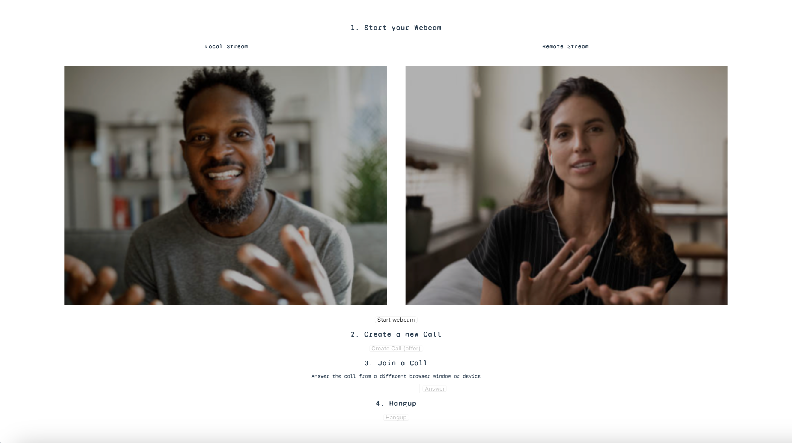

# **Video Chat App**

## General Overview

This is a video chat app that allows for live video conferencing between any two users, utilizing firebase 9.

## Screenshots

## Technologies Used

- HTML
- CSS
- JavaScript
- WebRTC
- Firebase 9
- Firestore

## Deployment

Currently, this application is not deployed as it would expose secret keys.

## Future Work

- **Convert to Therapy Application**: Eventually I would like to convert this static web app to a full stack application with a backend to be used for a therapy practice. This will allow for a deployment and also have real world application with no need for zoom. All can be done natively in the website.